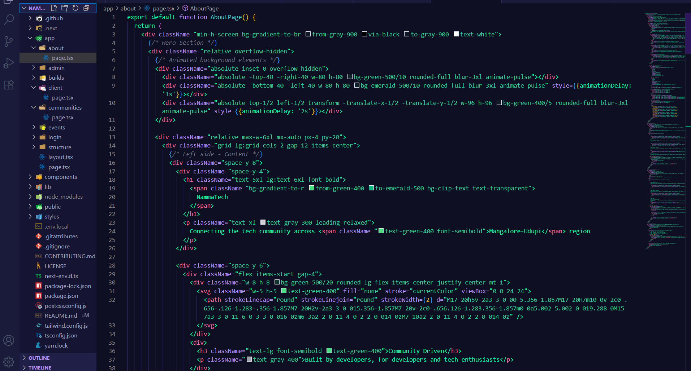

# Nocturna — A Dark Theme for Visual Studio Code

**Nocturna** is a sleek and immersive dark theme for VS Code, built for developers who love working in calm, focused environments with deep, moody tones.

##  Preview

## Installation

You can install Nocturna directly from the Visual Studio Code Marketplace:

1. Open **Extensions** panel in VS Code
2. Search for `Nocturna Theme`
3. Click **Install** and select the theme

Or install from the VSCode [Marketplace](https://marketplace.visualstudio.com/items?itemName=ShonDsouza.nocturna-theme).
